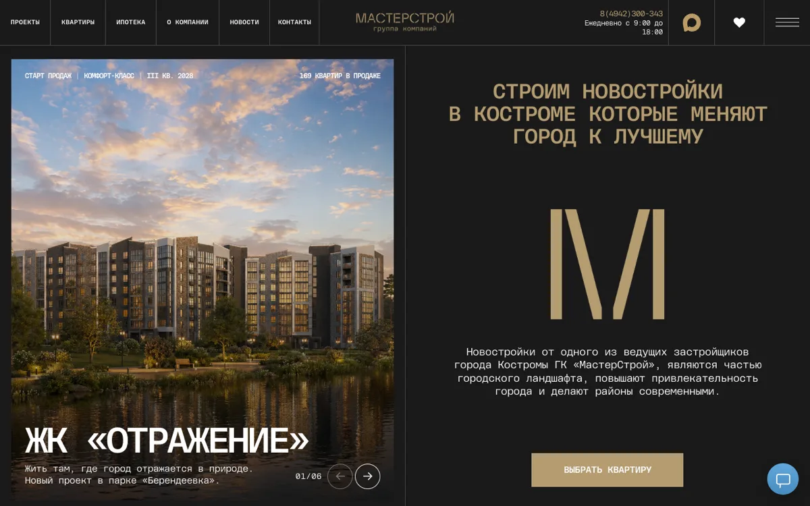
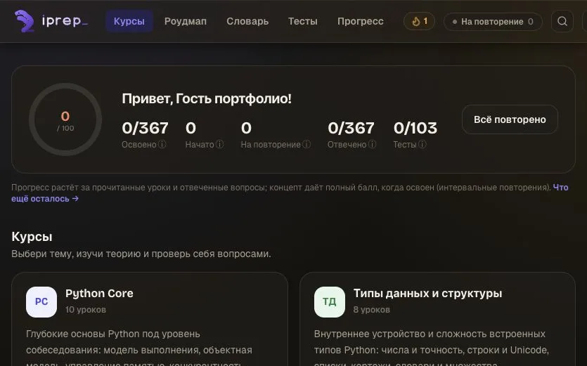
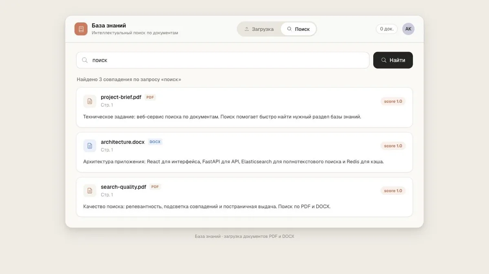
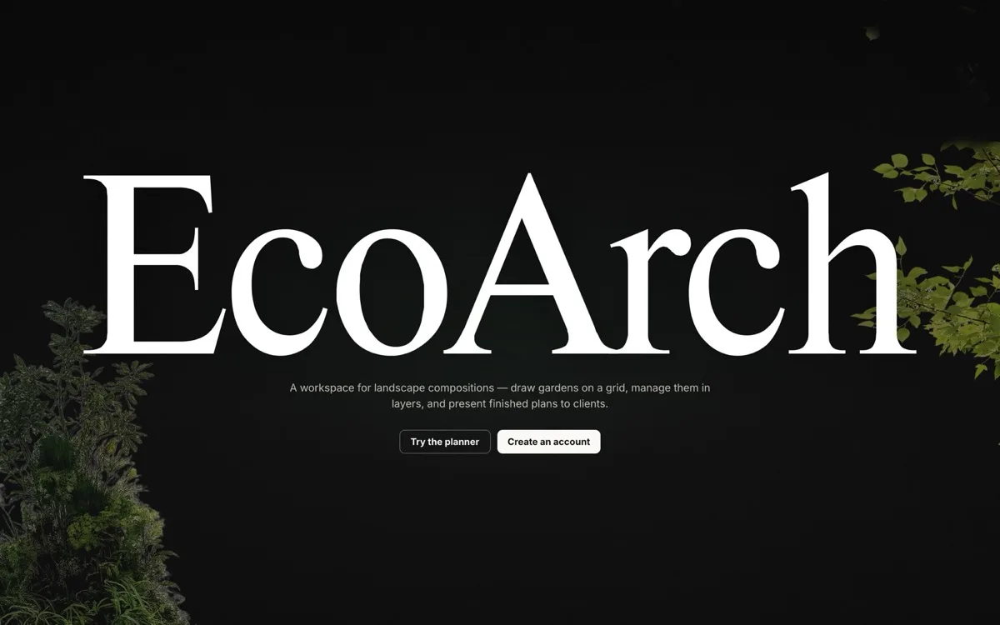
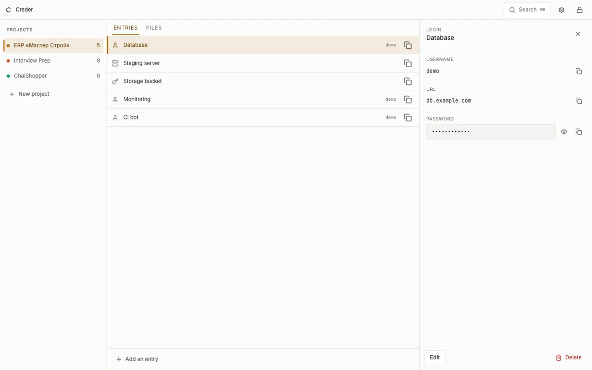
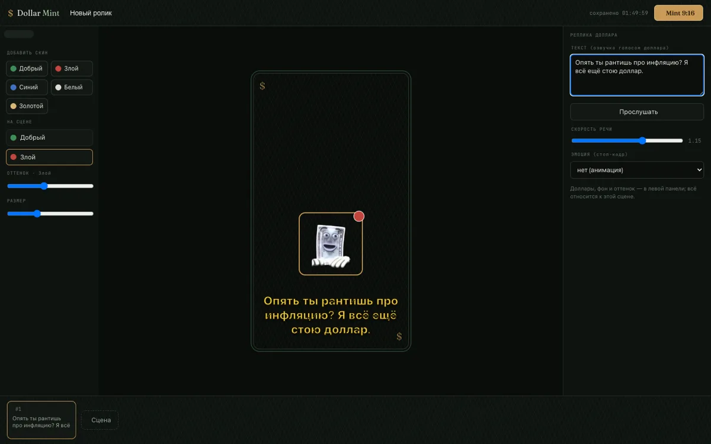

# Артём Ребриков

**Backend & Fullstack-разработчик** · FastAPI / Spring Boot · Next.js · 1С-Битрикс · Москва

Делаю backend-сервисы и сайты под ключ: от API и базы до вёрстки из Figma и выкладки в прод.

**2 проекта в проде** · **40+ публичных репо** · **3 языка backend** — Python, Java, Go

---

## Чем могу быть полезен

<table>
<tr>
<td width="33%" valign="top">

### ⚙️ Backend / API
REST-сервисы на FastAPI или Spring Boot, PostgreSQL, очереди (Kafka, Celery), авторизация, тесты, CI/CD и деплой в Docker.

</td>
<td width="33%" valign="top">

### 🖥 Fullstack-веб
Next.js / React + TypeScript, дизайн-система, анимации, интеграция с API — от макета до продакшена.

</td>
<td width="33%" valign="top">

### 🏗 Сайты для бизнеса
1С-Битрикс, headless WordPress + Next.js, точный перенос из Figma, адаптивы, деплой и поддержка.

</td>
</tr>
</table>

## Стек

**Backend**

**Frontend**

**Data & Infra**

**CMS**

**Качество**

**AI / ML**

## 🚀 В продакшене

<table>
<tr>
<td width="50%" valign="top">

### Сайт застройщика
🟢 **live** — [masterstroy44.ru](https://masterstroy44.ru)

Многостраничный сайт застройщика (Кострома): жилые комплексы, каталог квартир с планировками, ипотечные программы, формы заявок. Перенос из Figma в шаблон 1С-Битрикс, три адаптива, интеграция с инфоблоками.

</td>
<td width="50%" valign="top">

### Interview Prep
🟢 **live** — [демо-стенд](https://176.123.168.87.sslip.io/)

Платформа подготовки к техническим собеседованиям: теория по курсам, ответ пользователя проверяет ИИ по базе знаний сайта, слабые темы возвращаются по spaced repetition. Курсы, роадмап, тесты, прогресс по концептам.

</td>
</tr>
</table>

Также: **ERP для строительной компании** — FastAPI + Next.js, канбан / диаграмма Ганта / файлы / чат, Docker + Helm, CI/CD (закрытый проект).

## 🧩 Open-source

<table>
<tr>
<td width="50%" valign="top">

### [Booking API](https://github.com/DoonyFreeman/Booking_API_Service)
Асинхронный backend бронирования: слои сервис/репозиторий, миграции, кеш, фоновые задачи, тесты и CI.

</td>
<td width="50%" valign="top">

### [Online Shop API](https://github.com/DoonyFreeman/redis-kafka)
E-commerce backend с событийной архитектурой: изменения состояния уходят в Kafka, consumer обрабатывает их отдельно от запроса.

</td>
</tr>
<tr>
<td width="50%" valign="top">

### [Realtime Messenger](https://github.com/DoonyFreeman/WebSocket_Messenger)
Мессенджер на WebSocket: presence, вложения, доставка без перезагрузки страницы, Supabase Auth.

</td>
<td width="50%" valign="top">

### [Console Upscaler](https://github.com/DoonyFreeman/Console_upscaler)
Нативное macOS-приложение: апскейл фото 2×/4× через Real-ESRGAN на Apple Silicon (MPS), восстановление лиц GFPGAN, drag-and-drop и CLI.

</td>
</tr>
<tr>
<td width="50%" valign="top">

### [License Plate Recognition](https://github.com/DoonyFreeman/Car_detection_YOLO)
Распознавание автомобильных номеров на видео: детекция YOLO, чтение EasyOCR, пайплайн на OpenCV.

</td>
<td width="50%" valign="top">

### [Tech-Support Triager](https://github.com/DoonyFreeman/Smart_supporter)
Автоматический триаж обращений поддержки: классификация, приоритет, маршрутизация.

</td>
</tr>
</table>

Telegram-боты на aiogram: [таск-менеджер с напоминаниями](https://github.com/DoonyFreeman/Task_Manager_TG_Bot) · [напоминания о праздниках](https://github.com/DoonyFreeman/celebrate_manager_bot) · [совместный wishlist](https://github.com/DoonyFreeman/Our_wants_bot)

## 🤝 В команде

<table>
<tr>
<td width="50%" valign="top">

### [DocFind](https://github.com/Nek1s/DocFind)
Интеллектуальный поиск по внутренней базе документов: загрузка PDF/DOCX, полнотекстовый поиск с подсветкой совпадений, метрики в Grafana / Prometheus, всё поднимается одной командой.

**Моя роль:** backend, индексация документов, метрики — 48 коммитов.

</td>
<td width="50%" valign="top">

### EcoArch
Студия проектирования ландшафтных композиций: сад на масштабной сетке, растения по слоям, вид сбоку и сверху, проверка совместимости растений. 442 теста, 92 % покрытие.

**Моя роль:** backend и часть фронтенда — 40 коммитов. Закрытый репозиторий.

</td>
</tr>
</table>

## 🔒 Закрытые проекты

<table>
<tr>
<td width="50%" valign="top">

### Creder
Менеджер секретов по проектам: пароли, серверы, API-ключи, заметки, файлы, TOTP. Шифрование в браузере через WebCrypto — сервер хранит только шифротекст и не может прочитать записи. Второй фактор, passkeys, код восстановления.

</td>
<td width="50%" valign="top">

### Dollar Editor
Веб-редактор вертикальных мем-роликов 9:16: шаблоны, персонажи-«доллары» со скинами и эмоциями, реплики с озвучкой, сцены на таймлайне, фоновый рендер видео через FFmpeg, файлы в S3.

</td>
</tr>
</table>

Также: **AI Classroom Copilot** — ассистент для лекций в реальном времени: Android (Kotlin / Compose) + FastAPI realtime backend.

---

## Контакты

Открыт к заказам и сотрудничеству.

